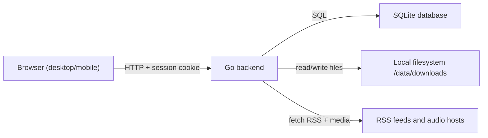
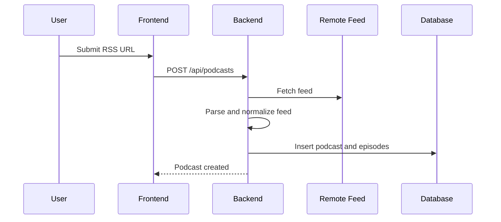
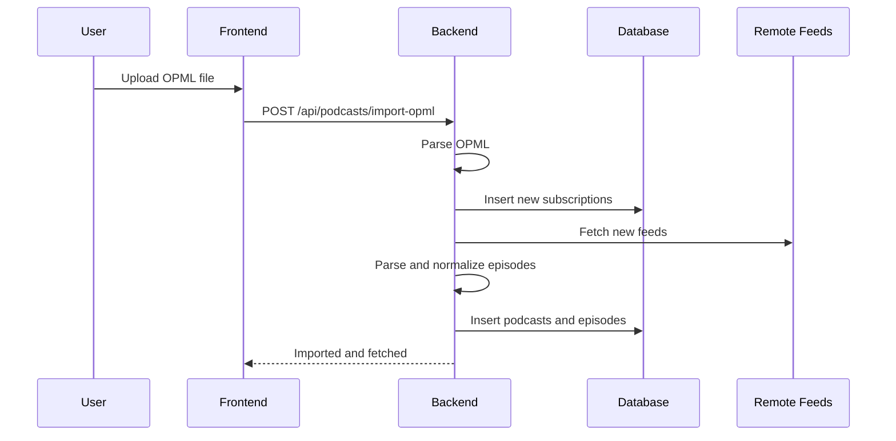
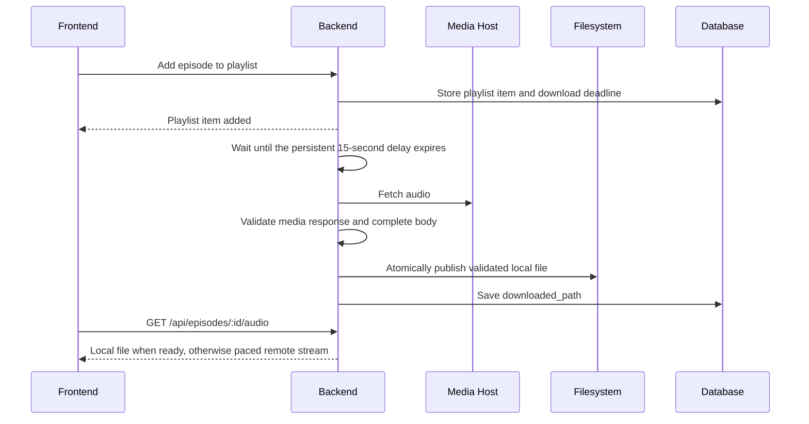
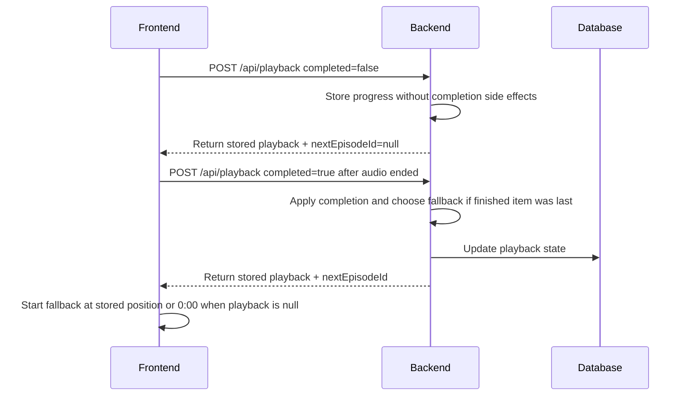

# mpod - Architecture

This document describes the proposed system architecture for mpod based on the current PRD and approved product decisions.

## Overview

mpod is a single-user personal web application for podcast subscription management, episode downloading, playlist management, and synced playback across devices.

The system is intentionally small:
- React frontend
- Go backend
- SQLite database
- Local filesystem storage for downloaded audio
- Single-container Docker deployment

The architecture should optimize for:
- simplicity
- low operational overhead
- predictable local self-hosting
- easy iteration during MVP

## High-Level Structure

mpod consists of three main layers:
- frontend application
- backend application
- persistent storage

At runtime:
- the frontend is served by the backend
- the frontend communicates with the backend through `/api`
- the backend reads and writes SQLite data
- the backend stores downloaded media files on disk
- the backend performs scheduled RSS refresh jobs
- `SIGTERM` and `SIGINT` stop the scheduler, allow active HTTP requests up to 10 seconds to finish, and then close SQLite

## System Diagram



## Major Components

### Frontend

The frontend is a React application responsible for:
- login and initial registration flow
- displaying podcasts and episodes
- playlist management UI
- player controls
- triggering downloads and refresh actions
- sending playback progress updates

Frontend responsibilities:
- render application state returned by the API
- keep client routing simple
- avoid business rules that belong on the server
- treat server responses as the source of truth

The frontend should not:
- decide feed deduplication logic
- decide playback conflict resolution
- manipulate files directly
- store authoritative playback state long-term

### Backend

The backend is a Go application and is the main source of truth for product behavior.

Backend responsibilities:
- auth and session handling
- initial one-time registration
- podcast CRUD
- RSS fetching and parsing
- OPML import/export
- episode persistence
- playlist persistence and ordering
- playback sync logic
- download and file deletion logic
- scheduled refresh execution

The backend should be split into focused modules rather than one large server file.

Suggested backend areas:
- API routes/controllers
- services containing business logic
- repository/data-access layer
- scheduler/job logic
- feed parsing/import logic
- file storage logic
- auth/session setup
- database migrations and startup checks

### Database

SQLite is the only database for MVP.

The database stores:
- user account
- podcast subscriptions
- episode metadata
- playlist order
- playback state
- settings/state needed by scheduler

SQLite is appropriate because:
- only one user exists
- deployment must stay simple
- data volume is modest
- Docker-friendly persistence is enough

The project should use explicit database migrations from day one.

Migration guidance:
- do not rely on automatic schema sync in production
- keep migrations under `server/migrations/`
- persist schema version in the database
- treat initial schema design as part of application architecture, not temporary bootstrap code

### SQLite Driver

The project uses `github.com/mattn/go-sqlite3` (CGO-based) as the SQLite driver.

This driver was chosen over `modernc.org/sqlite` (pure Go) because:
- `modernc.org/sqlite` contains ~9 MB per-platform generated Go source files that take 30–90 minutes to compile on low-power hardware (NAS, CI runners with limited CPU/RAM), making Docker builds impractical on the deployment target
- `mattn/go-sqlite3` compiles SQLite as native C code via CGO, which takes seconds regardless of hardware
- The Docker build image (`golang:1.24-alpine`) already includes the necessary C toolchain with `build-base`
- The trade-off (CGO requirement in build) is acceptable because the app is built exclusively inside Docker containers where gcc is controlled

Build implications:
- Dockerfile uses `CGO_ENABLED=1` and installs `build-base` in the builder stage
- The final runtime image remains a minimal `alpine` with no C toolchain
- Dependencies are downloaded via `go mod download` during Docker build rather than vendored, keeping the build context small (~20 MB instead of ~250 MB)

Every pooled SQLite connection enables foreign-key enforcement, WAL journal mode, and a five-second busy timeout through the driver DSN. Domain handling of constraint failures uses SQLite error codes rather than matching human-readable error text. Startup treats a missing migrated table as a fatal consistency error instead of silently skipping reconciliation.

### Filesystem Storage

The local filesystem stores downloaded episode audio files under `/data/downloads`.

Before opening the application, the backend creates the configured downloads directory and verifies it can create, close, and remove a temporary file there. Startup fails with a clear error if the mounted storage path is unavailable or not writable.

The filesystem is used only for:
- episode download storage
- file existence checks
- deletion when lifecycle rules require it

The filesystem is not the source of truth for metadata. The database is.

## Suggested Project Structure

One reasonable starting structure:

```text
mpod/
  frontend/
    src/
      app/
      components/
      features/
      lib/
  server/
    cmd/
      mpod/
    internal/
      app/
      http/
      auth/
      podcasts/
      feeds/
      episodes/
      playlist/
      playback/
      downloads/
      scheduler/
      settings/
      storage/
    migrations/
  docs/
    architecture.md
    product-decisions.md
  docker-compose.yml
  Dockerfile
  README.md
```

Alternative structure is possible, but the important rule is separation by responsibility, not exact folder names.

## Backend Module Responsibilities

### Auth Module

Responsible for:
- checking whether setup is required
- one-time registration
- login/logout
- session creation and destruction
- route protection

Key rule:
- registration is allowed only if no user exists

### Podcast Module

Responsible for:
- add podcast by RSS URL
- delete podcast
- list podcasts
- fetch podcast details
- trigger refresh for one podcast
- validate duplicate subscriptions

This module coordinates feed parsing but should not contain low-level XML parsing itself.

### Feed Import Module

Responsible for:
- fetching RSS/Atom feeds
- parsing feed documents
- normalizing feed data
- computing `external_episode_key`
- deduplicating episodes
- updating existing episode metadata
- returning structured results to the podcast service
- keeping OPML feed fetching sequential, limiting an import to 1,000 unique feed URLs, and rejecting overlapping OPML import jobs

This module should encapsulate all external feed quirks so the rest of the app works with normalized data.

### Episode Module

Responsible for:
- read episode details
- mark listened/unlistened
- resolve downloaded state from DB/file system
- prepare episode data for UI/API

This module should cooperate with file storage rules but not directly own download transport.

### Playlist Module

Responsible for:
- add/remove podcast episodes
- add/remove standalone audiobooks and folder-backed audiobooks
- maintain one playlist row per folder-backed audiobook
- merge individually selected chapters into the parent audiobook item
- add all missing chapters when a whole book is added after individual chapter selection
- maintain selected chapter membership without unpacking the book into separately reorderable queue rows
- prevent duplicate playlist entries
- reorder playlist
- read current ordered playlist

Playlist order should be stored explicitly, not inferred. Chapters inside an audiobook follow natural track order and are not independently reorderable.

### Playback Module

Responsible for:
- read podcast episode and audiobook-track playback positions
- apply playback sync rules
- mark podcast episodes or audiobook chapters complete when appropriate
- advance to the next selected audiobook chapter
- remove a book after its final selected chapter becomes listened
- reset audiobook progress/listened state when the book leaves the playlist so a later add starts over
- trigger listened/file lifecycle side effects required by completion rules

Playback conflict resolution belongs entirely to the server.

### Download Module

Responsible for:
- download episode media
- sanitize filenames
- create podcast download directories
- delete downloaded files
- verify file existence when needed
- keep `downloaded_path` aligned with disk state

This module should use one shared HTTP client configuration path so proxy-aware network behavior and outbound URL validation are consistent across all backend network operations, including RSS fetching, scheduled refreshes, media downloads, audio proxying, image proxying, and proxy identity lookup. The shared transport accepts only HTTP(S) targets without embedded credentials and revalidates every redirect. Private and loopback HTTP(S) targets remain valid for trusted local-network podcast sources.

### Scheduler Module

Responsible for:
- loading configured refresh time
- scheduling daily refresh execution
- preventing overlapping runs
- retrying failed feed refreshes
- exposing scheduler status

The scheduler should reuse the same podcast refresh service used by manual refresh so behavior stays consistent.
The scheduling trigger and refresh execution logic should be separated so execution is testable without real timers.

### Settings Module

Responsible for:
- reading current app settings
- updating daily refresh time
- persisting separate podcast and audiobook playback speed preferences
- updating whether configured SOCKS5 proxy usage is enabled
- exposing configuration values that belong in user-managed settings instead of environment variables

### Audiobooks Module

Responsible for:
- scanning `AUDIOBOOKS_DIR` (default `/share/audio/abooks/`) for `.mp3`, `.m4b`, `.m4a` files
- grouping folders and single files into Audiobooks and Tracks/Chapters
- treating directories without direct audio files as navigable collection levels
- parsing audio duration and extracting cover art (folder files `cover.jpg`/`png`, embedded ID3v2 APIC / MP4 `covr`, or 3D fallback `fallback-audio`)
- keeping playback and queue identities media-typed (`episodeId`, or `audiobookId` with `trackId`) instead of relying on numeric IDs that can overlap across tables
- running a background `fsnotify` (`inotify`) watcher with debounced rescanning
- keeping newly discovered tracks out of already configured playlist items until the user selects them
- serving audiobook chapter audio with `Range` request support
- applying the backend-owned audiobook speed preference, defaulting to `1.0x` (`Speed 1x`)
- treating audiobook storage as strictly read-only (mpod never deletes audiobook files from disk)

## Data Model View

Initial logical entities:
- `users`
- `podcasts`
- `episodes`
- `audiobooks`
- `audiobook_tracks`
- `audiobook_playlist_tracks`
- `playlist`
- `playback`
- `settings`

Expected relationships:
- one user owns the whole app state
- one podcast has many episodes
- playlist references podcast episodes or audiobooks in ordered form
- one folder-backed audiobook has at most one playlist row
- `audiobook_playlist_tracks` records the chapters selected inside that audiobook item without unpacking the book into separate queue rows; newly scanned chapters have no membership row and therefore do not enter an existing item automatically
- playback references one podcast episode or one selected audiobook track
- settings store separate podcast and audiobook playback speed preferences

Recommended additions beyond the PRD:
- a `settings` table for values like `daily_refresh_time`
- scheduler status fields either in `settings` or a dedicated lightweight job-state table
- an episode identity field such as `external_episode_key` for deduplication
- `episodes.description`
- `podcasts.description`
- `podcasts.image_url`

## Request Flow

### Add Podcast



### Import OPML



### Smart Listening Download



### Playback Sync



## Session and Auth Flow

Auth uses server-side sessions with cookies.

Session records expire after 30 days. The backend removes all expired session rows at startup and before creating a new login session; an expired session presented by a client is also deleted immediately. A session is invalid once its expiration timestamp is reached.

HTTP responses set a restrictive Content Security Policy, disable MIME sniffing, and use a same-origin referrer policy. State-changing `/api` requests with an `Origin` header are accepted only when that origin matches the effective request scheme and host. Requests without `Origin` remain available to trusted local non-browser clients; session cookies retain `HttpOnly`, `SameSite=Lax`, and HTTPS-aware `Secure` behavior.

Expected flow:
- if no user exists, frontend shows setup flow
- first registration creates user and starts session
- later logins create session
- protected API routes require valid session
- logout destroys session

The frontend should use `GET /api/auth/session` at startup to decide:
- setup required
- login required
- authenticated app state

The frontend also revalidates the session when an authenticated tab returns to the foreground or is restored from the back-forward cache. Any `401 Unauthorized` response from the API invalidates the current frontend auth state, unmounts authenticated providers and cached protected views, and triggers a session recheck before routing to login or setup.

## Download and File Flow

The database is authoritative for whether an episode is expected to have a file, but the backend must verify actual file presence when relevant.

Rules carried into architecture:
- downloaded files are disposable local copies
- playlist items are automatically downloaded after a persistent 15-second delay
- playlist items already present at startup are downloaded immediately when no valid local file exists
- removing from playlist deletes file by default
- marking listened deletes file by default
- file deletion and DB updates should stay consistent

Recommended implementation approach:
- centralize file operations in one service
- run one backend Smart Listening worker that processes due playlist downloads sequentially
- deduplicate concurrent download requests per episode inside the download service
- keep the audio URL stable and select local-file or upstream-stream delivery on the backend
- pace remote audio responses when total size and episode duration are known, allowing a short initial buffer and modest bitrate headroom instead of letting the browser eagerly fetch the full file
- never scatter direct `fs` deletion calls across unrelated modules
- run startup reconciliation that clears stale `downloaded_path` values when files are missing

## Refresh and Scheduler Flow

Both manual refresh and scheduled refresh should reuse the same core flow:
- load target podcast(s)
- fetch feed
- parse and normalize entries
- deduplicate against stored episodes
- insert new episodes
- update mutable episode metadata
- update `last_checked` and status fields

This avoids subtle differences between manual and scheduled behavior.
Manual refresh may target a single podcast or all podcasts, but the backend must prevent overlapping refreshes for the same podcast.

## Episode Audio Delivery

Playback uses a backend audio endpoint instead of exposing storage paths to the frontend.
When a downloaded file exists locally, the backend serves that file.
When no local file exists, the backend proxies the remote episode audio URL through the authenticated audio endpoint.
Remote proxying must preserve playback needs such as Range requests so browser media controls can seek.
When SOCKS5 proxy usage is enabled, playback streaming uses that proxy first. If that proxied response fails or is clearly not playable audio, the backend may make one direct retry for this playback request only, because public podcast CDNs can block individual proxy exits while still serving the same audio directly.
This keeps file storage, authentication, and proxy-aware network behavior on the backend while still allowing streaming before download.

## Configuration Boundaries

Two kinds of configuration exist:

Environment-level configuration:
- `PORT`
- `TZ`
- `SESSION_SECRET`
- `DATA_DIR`
- `DB_PATH`
- `DOWNLOADS_DIR`
- SOCKS5 settings

User-managed application settings:
- daily refresh time
- proxy enabled/disabled
- podcast playback speed, default `Speed 1.3x`
- audiobook playback speed, default `Speed 1x`

Rule:
- environment variables define infrastructure/runtime behavior
- database-backed settings define behavior the user can change inside the app
- SOCKS5 host, port, username, and password stay in environment variables; Settings only controls whether the configured proxy is used

## Error Handling Principles

The system should prefer partial success over all-or-nothing failure where appropriate.

Examples:
- one bad RSS feed should not stop refresh of other podcasts
- one failed download should not corrupt unrelated state
- missing local file should be reconciled, not treated as fatal app corruption

Recommended principles:
- fail fast on invalid auth/session conditions
- fail per item for feed import and refresh
- return clear API errors
- log enough detail for debugging local installs

## Security and Scope

Because this is a local personal app, architecture should not overcomplicate security or multi-user concerns.

Out of current scope:
- public registration
- multi-user roles
- OAuth
- cloud object storage
- distributed job queue
- external database
- API rate limiting by default
- media transcoding

## Architecture Constraints

The implementation should preserve these constraints:
- single-user only
- SQLite only for MVP
- one backend process
- one scheduler in the backend process
- local disk storage for downloads
- session-based auth
- minimal REST API

## Open Items For Later

These are intentionally deferred:
- testing strategy and CI layout
- exact ORM/query builder choice
- exact RSS parser library
- exact audio player library on the frontend
- handling malformed audiobook directory layouts outside the supported library contract

These can be decided later without changing the overall architecture direction.

## Suggested Implementation Order

Recommended build order:
1. backend and frontend scaffolds
2. database schema and migrations
3. auth flow
4. RSS add/import flow
5. playlist and download flow
6. playback and sync flow
7. scheduler
8. audiobook scanner and read-only media delivery
9. audiobook library navigation and chapter selection
10. mixed-media playlist, completion, and separate speed persistence

This order gets the core value working before adding background automation.
