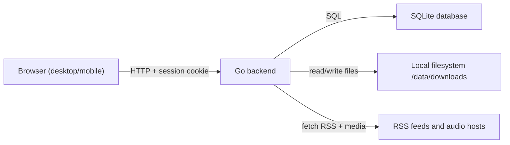
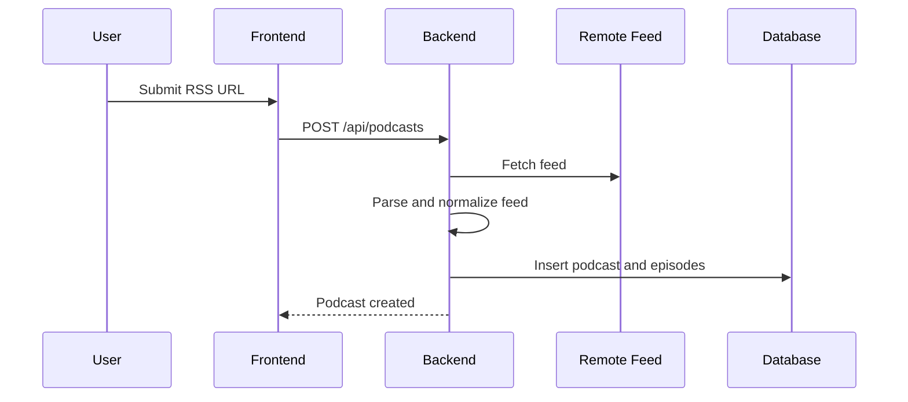
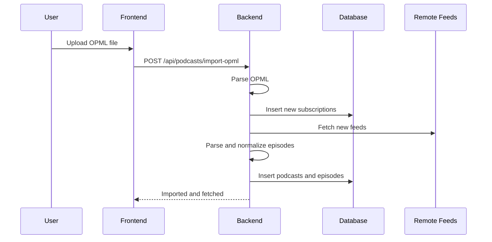
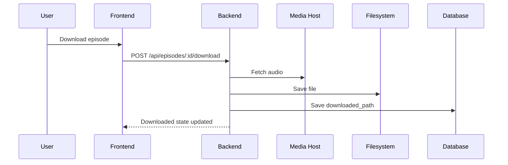
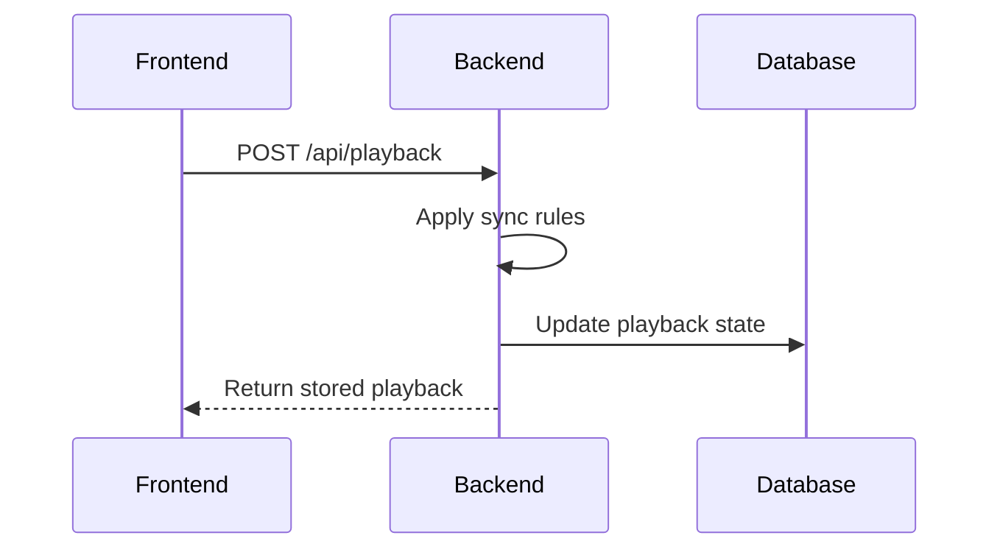

# mpod - Architecture

This document describes the proposed system architecture for mpod based on the current PRD and approved product decisions.

## Overview

mpod is a single-user personal web application for podcast subscription management, episode downloading, playlist management, and synced playback across devices.

The system is intentionally small:
- React frontend
- Go backend
- SQLite database
- Local filesystem storage for downloaded audio
- Single-container Docker deployment

The architecture should optimize for:
- simplicity
- low operational overhead
- predictable local self-hosting
- easy iteration during MVP

## High-Level Structure

mpod consists of three main layers:
- frontend application
- backend application
- persistent storage

At runtime:
- the frontend is served by the backend
- the frontend communicates with the backend through `/api`
- the backend reads and writes SQLite data
- the backend stores downloaded media files on disk
- the backend performs scheduled RSS refresh jobs

## System Diagram



## Major Components

### Frontend

The frontend is a React application responsible for:
- login and initial registration flow
- displaying podcasts and episodes
- playlist management UI
- player controls
- triggering downloads and refresh actions
- sending playback progress updates

Frontend responsibilities:
- render application state returned by the API
- keep client routing simple
- avoid business rules that belong on the server
- treat server responses as the source of truth

The frontend should not:
- decide feed deduplication logic
- decide playback conflict resolution
- manipulate files directly
- store authoritative playback state long-term

### Backend

The backend is a Go application and is the main source of truth for product behavior.

Backend responsibilities:
- auth and session handling
- initial one-time registration
- podcast CRUD
- RSS fetching and parsing
- OPML import/export
- episode persistence
- playlist persistence and ordering
- playback sync logic
- download and file deletion logic
- scheduled refresh execution

The backend should be split into focused modules rather than one large server file.

Suggested backend areas:
- API routes/controllers
- services containing business logic
- repository/data-access layer
- scheduler/job logic
- feed parsing/import logic
- file storage logic
- auth/session setup
- database migrations and startup checks

### Database

SQLite is the only database for MVP.

The database stores:
- user account
- podcast subscriptions
- episode metadata
- playlist order
- playback state
- settings/state needed by scheduler

SQLite is appropriate because:
- only one user exists
- deployment must stay simple
- data volume is modest
- Docker-friendly persistence is enough

The project should use explicit database migrations from day one.

Migration guidance:
- do not rely on automatic schema sync in production
- keep migrations under `server/migrations/`
- persist schema version in the database
- treat initial schema design as part of application architecture, not temporary bootstrap code

### Filesystem Storage

The local filesystem stores downloaded episode audio files under `/data/downloads`.

The filesystem is used only for:
- episode download storage
- file existence checks
- deletion when lifecycle rules require it

The filesystem is not the source of truth for metadata. The database is.

## Suggested Project Structure

One reasonable starting structure:

```text
mpod/
  client/
    src/
      app/
      components/
      features/
      lib/
  server/
    cmd/
      mpod/
    internal/
      app/
      http/
      auth/
      podcasts/
      feeds/
      episodes/
      playlist/
      playback/
      downloads/
      scheduler/
      settings/
      storage/
    migrations/
  docs/
    architecture.md
    product-decisions.md
  docker-compose.yml
  Dockerfile
  README.md
```

Alternative structure is possible, but the important rule is separation by responsibility, not exact folder names.

## Backend Module Responsibilities

### Auth Module

Responsible for:
- checking whether setup is required
- one-time registration
- login/logout
- session creation and destruction
- route protection

Key rule:
- registration is allowed only if no user exists

### Podcast Module

Responsible for:
- add podcast by RSS URL
- delete podcast
- list podcasts
- fetch podcast details
- trigger refresh for one podcast
- validate duplicate subscriptions

This module coordinates feed parsing but should not contain low-level XML parsing itself.

### Feed Import Module

Responsible for:
- fetching RSS/Atom feeds
- parsing feed documents
- normalizing feed data
- computing `external_episode_key`
- deduplicating episodes
- updating existing episode metadata
- returning structured results to the podcast service

This module should encapsulate all external feed quirks so the rest of the app works with normalized data.

### Episode Module

Responsible for:
- read episode details
- mark listened/unlistened
- resolve downloaded state from DB/file system
- prepare episode data for UI/API

This module should cooperate with file storage rules but not directly own download transport.

### Playlist Module

Responsible for:
- add episode to playlist
- remove episode from playlist
- prevent duplicate playlist entries
- reorder playlist
- read current ordered playlist

Playlist order should be stored explicitly, not inferred.

### Playback Module

Responsible for:
- read playback position
- apply playback sync rules
- mark episode complete when appropriate
- trigger listened/file lifecycle side effects required by completion rules

Playback conflict resolution belongs entirely to the server.

### Download Module

Responsible for:
- download episode media
- sanitize filenames
- create podcast download directories
- delete downloaded files
- verify file existence when needed
- keep `downloaded_path` aligned with disk state

This module should use one shared HTTP client configuration path so proxy-aware network behavior is consistent across RSS fetching and media downloads.

### Scheduler Module

Responsible for:
- loading configured refresh time
- scheduling daily refresh execution
- preventing overlapping runs
- retrying failed feed refreshes
- exposing scheduler status

The scheduler should reuse the same podcast refresh service used by manual refresh so behavior stays consistent.
The scheduling trigger and refresh execution logic should be separated so execution is testable without real timers.

### Settings Module

Responsible for:
- reading current app settings
- updating daily refresh time
- exposing configuration values that belong in user-managed settings instead of environment variables

## Data Model View

Initial logical entities:
- `users`
- `podcasts`
- `episodes`
- `playlist`
- `playback`
- `settings`

Expected relationships:
- one user owns the whole app state
- one podcast has many episodes
- playlist references episodes in ordered form
- playback references one episode

Recommended additions beyond the PRD:
- a `settings` table for values like `daily_refresh_time`
- scheduler status fields either in `settings` or a dedicated lightweight job-state table
- an episode identity field such as `external_episode_key` for deduplication
- `episodes.description`
- `podcasts.description`
- `podcasts.image_url`

## Request Flow

### Add Podcast



### Import OPML



### Download Episode



### Playback Sync



## Session and Auth Flow

Auth uses server-side sessions with cookies.

Expected flow:
- if no user exists, frontend shows setup flow
- first registration creates user and starts session
- later logins create session
- protected API routes require valid session
- logout destroys session

The frontend should use `GET /api/auth/session` at startup to decide:
- setup required
- login required
- authenticated app state

## Download and File Flow

The database is authoritative for whether an episode is expected to have a file, but the backend must verify actual file presence when relevant.

Rules carried into architecture:
- downloaded files are disposable local copies
- removing from playlist deletes file by default
- marking listened deletes file by default
- file deletion and DB updates should stay consistent

Recommended implementation approach:
- centralize file operations in one service
- never scatter direct `fs` deletion calls across unrelated modules
- run startup reconciliation that clears stale `downloaded_path` values when files are missing

## Refresh and Scheduler Flow

Both manual refresh and scheduled refresh should reuse the same core flow:
- load target podcast(s)
- fetch feed
- parse and normalize entries
- deduplicate against stored episodes
- insert new episodes
- update mutable episode metadata
- update `last_checked` and status fields

This avoids subtle differences between manual and scheduled behavior.

## Configuration Boundaries

Two kinds of configuration exist:

Environment-level configuration:
- `PORT`
- `TZ`
- `SESSION_SECRET`
- `DATA_DIR`
- `DB_PATH`
- `DOWNLOADS_DIR`
- SOCKS5 settings

User-managed application settings:
- daily refresh time

Rule:
- environment variables define infrastructure/runtime behavior
- database-backed settings define behavior the user can change inside the app

## Error Handling Principles

The system should prefer partial success over all-or-nothing failure where appropriate.

Examples:
- one bad RSS feed should not stop refresh of other podcasts
- one failed download should not corrupt unrelated state
- missing local file should be reconciled, not treated as fatal app corruption

Recommended principles:
- fail fast on invalid auth/session conditions
- fail per item for feed import and refresh
- return clear API errors
- log enough detail for debugging local installs

## Security and Scope

Because this is a local personal app, architecture should not overcomplicate security or multi-user concerns.

Out of current scope:
- public registration
- multi-user roles
- OAuth
- cloud object storage
- distributed job queue
- external database
- API rate limiting by default
- media transcoding

## Architecture Constraints

The implementation should preserve these constraints:
- single-user only
- SQLite only for MVP
- one backend process
- one scheduler in the backend process
- local disk storage for downloads
- session-based auth
- minimal REST API

## Open Items For Later

These are intentionally deferred:
- exact frontend routing structure
- visual UI design and screen details
- testing strategy and CI layout
- exact ORM/query builder choice
- exact RSS parser library
- exact audio player library on the frontend

These can be decided later without changing the overall architecture direction.

## Suggested Implementation Order

Recommended build order:
1. backend and frontend scaffolds
2. database schema and migrations
3. auth flow
4. RSS add/import flow
5. playlist and download flow
6. playback and sync flow
7. scheduler

This order gets the core value working before adding background automation.
